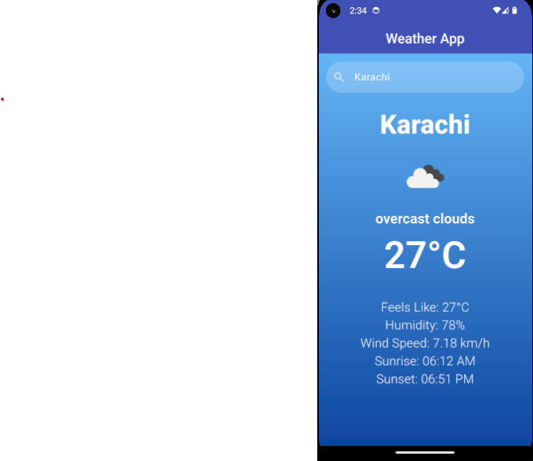

# 🌦️ Flutter Weather App

[](https://flutter.dev/)  
[](https://openweathermap.org/api)  
[](LICENSE)

A simple weather app built with **Flutter** that shows real-time weather for your current location or any city you search.

This project helped me practice **Flutter UI design, API integration, and location services** while creating something actually useful.

---

## ✨ Features

- 🌍 Automatically detects your current location
- 🔍 Search weather by city name
- 🌡️ Shows temperature, feels like, humidity, and wind speed
- ☀️ Displays sunrise and sunset times
- 🖼️ Weather icons powered by OpenWeather
- 🎨 Clean gradient UI + splash screen

---

## 📸 Screenshot



---

## 🚀 Getting Started

1. **Clone this repo**
   ```bash
   git clone https://github.com/<your-username>/flutter-weather-app.git
   cd flutter-weather-app
   Install dependencies
   ```

bash
Copy code
flutter pub get
Add your OpenWeather API key

Get a free key from OpenWeather

Open data_model/weather_data_model.dart

Replace with your API key:

dart
Copy code
final apiKey = "YOUR_API_KEY_HERE";
Run the app

bash
Copy code
flutter run
Build a release APK

bash
Copy code
flutter build apk --release
The APK will be available at:
build/app/outputs/flutter-apk/app-release.apk

🛠️ Tech Stack
Flutter + Dart

Geolocator — GPS location

Geocoding — Convert lat/lon to city

Intl — Format sunrise/sunset times

OpenWeather API

📄 License
This project is licensed under the MIT License.
You’re free to use, learn from, or improve it 🚀

💡 Why I Built This
I wanted to explore Flutter app development from scratch, covering:

Handling permissions (location)

Integrating a real-world API

Designing a clean, minimal UI

Deploying and packaging as an APK

It’s a small project, but it gave me a lot of hands-on experience with Flutter app lifecycle and publishing.
